# Smellful

Projet réalisé pour une Start-UP.
Smellful à pour objectif de créer un système de diffusion d'odeur contrôlable à distance via une application mobile.
Ce document présente une vue d'ensemble du projet et des fonctionnalités développées.

## Parties

Le projet Smellful se compose de deux parties distinctes :
- Partie Embedded :
La partie embarquée du projet est réalisée sur la plateforme Arduino. Elle est responsable de la gestion de la diffusion des différentes odeurs. Le système embarqué comprend l'ensemble de l'attirail nécessaire pour diffuser les odeurs de manière contrôlée et précise.

- Partie Mobile :
La partie mobile du projet est développée en utilisant le framework Flutter. Elle offre une interface utilisateur ergonomique et conviviale permettant aux utilisateurs de contrôler le processus de diffusion d'odeur de manière pratique et intuitive.

## Fonctionnalités

- **Contrôle des Odeurs :**
L'application mobile permet à l'utilisateur de sélectionner parmi 4 odeurs préenregistrées celle qu'il souhaite diffuser dans l'environnement cible. Chaque odeur est identifiée par un nom convivial pour faciliter la sélection.

- **Réglage de la Puissance de Diffusion :**
L'utilisateur peut ajuster la puissance de diffusion de l'odeur choisie. Cette fonctionnalité permet d'adapter l'intensité de l'odeur selon les préférences personnelles ou l'environnement.

- **Mode de Diffusion :**
Le système de diffusion prend en charge deux modes : permanent et par intermittence. L'utilisateur peut choisir le mode de diffusion qui correspond le mieux à ses besoins.

- **Mode Timeline :**
Le mode Timeline est une fonctionnalité avancée de l'application mobile. Il permet à l'utilisateur de créer une séquence de diffusion d'odeur avec des paramètres spécifiques. L'utilisateur peut programmer plusieurs étapes de diffusion avec différentes odeurs, puissances et modes de diffusion pour une expérience olfactive personnalisée.

## Technologie

Dans le cadre du projet Smellful, plusieurs technologies ont été utilisées pour permettre une expérience d'utilisation fluide et efficace. Voici un aperçu des technologies clés mises en œuvre.

### Connexion Bluetooth Low Energy (BLE)
La connexion entre l'appareil embarqué et l'application mobile a été réalisée en utilisant la technologie Bluetooth Low Energy (BLE). Le BLE offre une connectivité sans fil à faible consommation d'énergie, ce qui est essentiel pour préserver l'autonomie de l'appareil embarqué. Cette connexion bidirectionnelle permet à l'application mobile de communiquer efficacement avec le système embarqué, en lui envoyant des instructions de contrôle et en recevant des informations sur l'état du dispositif.

### Partie Embedded - Arduino
La partie embarquée du projet a été développée en utilisant la plateforme Arduino. Arduino est un microcontrôleur open-source populaire, offrant une flexibilité et une facilité de programmation pour créer des projets embarqués personnalisés. Dans le cas de Smellful, Arduino a été utilisé pour contrôler le matériel de diffusion d'odeur et gérer les interactions avec l'application mobile via la connexion BLE.

### Partie Mobile - Flutter
L'application mobile de Smellful a été développée en utilisant le framework Flutter. Flutter est une technologie de développement multiplateforme qui permet de créer des applications Android et iOS à partir d'un même code source. Grâce à Flutter, nous avons pu offrir une expérience utilisateur cohérente et fluide sur les deux plateformes, tout en réduisant les délais de développement.

### Système de Contrôle Optimisé
Pour garantir une expérience utilisateur réactive et sans latence, nous avons mis en place un système de contrôle optimisé dans l'application mobile. Par exemple, pour ajuster la puissance de diffusion, les utilisateurs peuvent simplement faire glisser leur doigt sur l'écran (drag). Cependant, envoyer une nouvelle valeur de puissance à chaque geste pourrait entraîner une surcharge de données et une réactivité insuffisante.

Pour optimiser le contrôle, nous avons développé un système intelligent qui ne transmet les nouvelles valeurs de puissance qu'après une courte pause d'inactivité gestuelle. En utilisant des algorithmes de filtrage et des seuils prédéfinis, nous avons réussi à réduire le nombre d'envois d'instructions sans compromettre la réactivité du système. Cela permet d'éviter les problèmes de saturation du réseau BLE et de préserver la batterie tant de l'appareil mobile que de l'appareil embarqué.

Grâce à cette optimisation, l'application offre une expérience de contrôle fluide et réactive, tout en assurant une gestion efficace et immédiate des instructions envoyées au système embarqué.

## Demo

### Mode timeline

  
[timeline_mode.webm](https://github.com/Lk2v/Smellful/assets/26687216/e63fd007-ce40-40fe-81ed-dfa68eed5126)

Presentation du mode timeline

### Screenshots

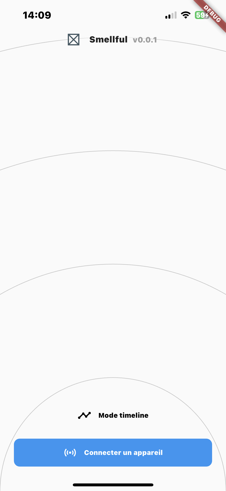

Page d'accueil

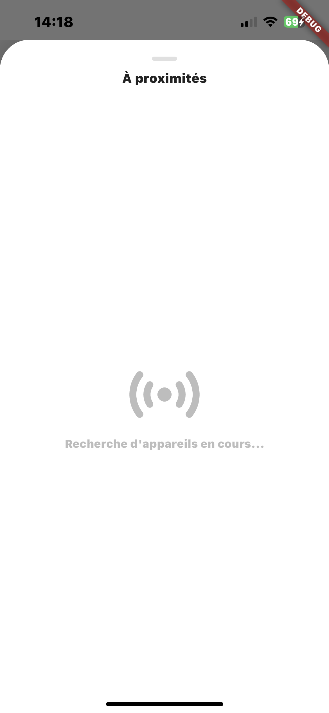

Page recherche d'appareil

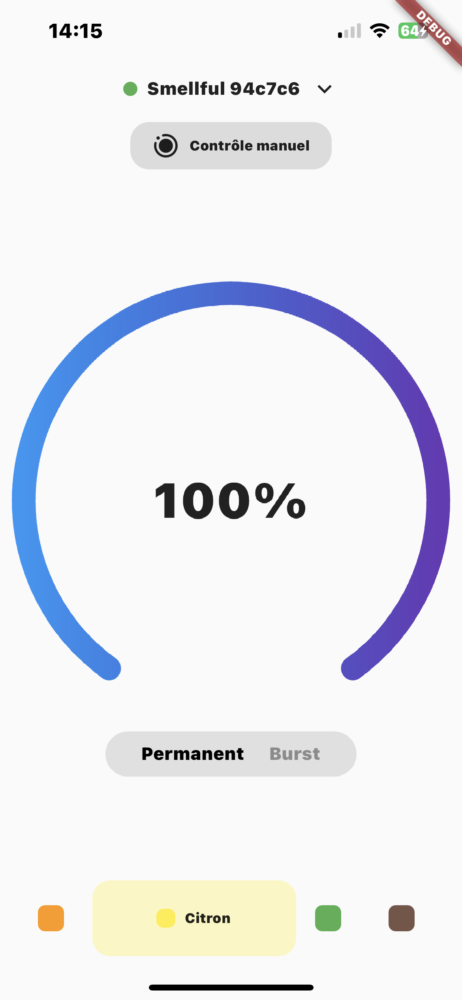

Page de controle

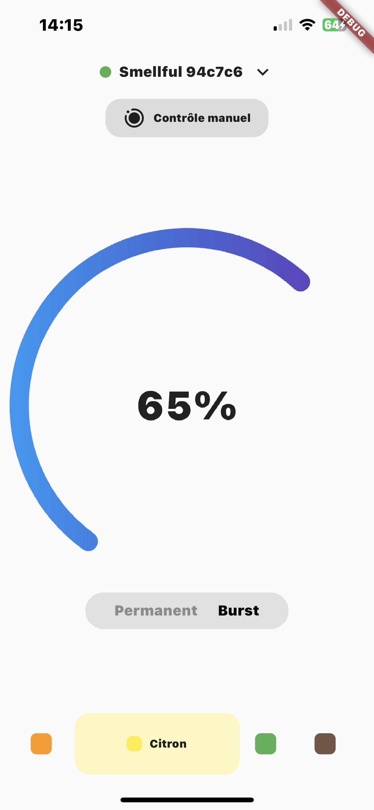
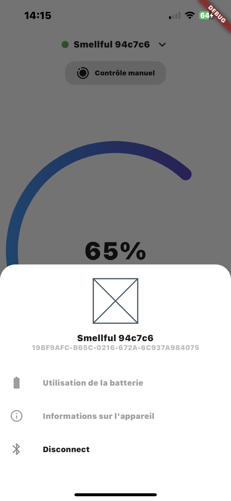
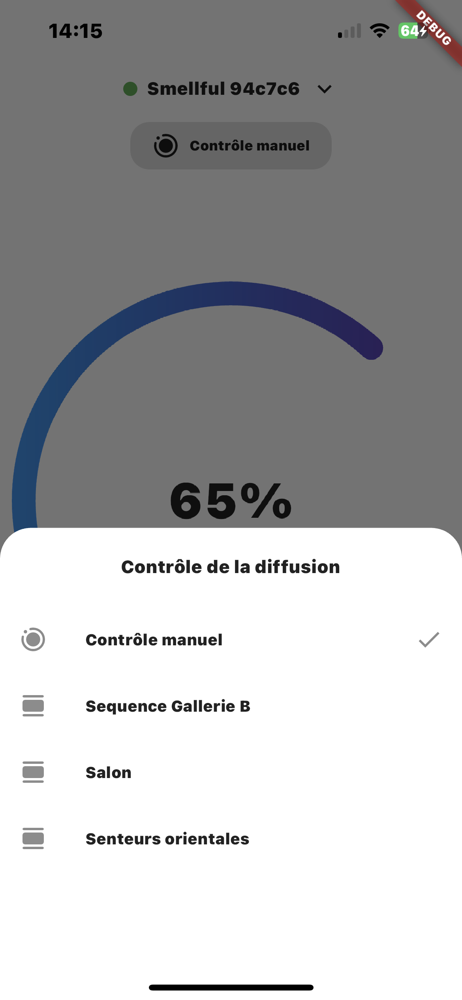
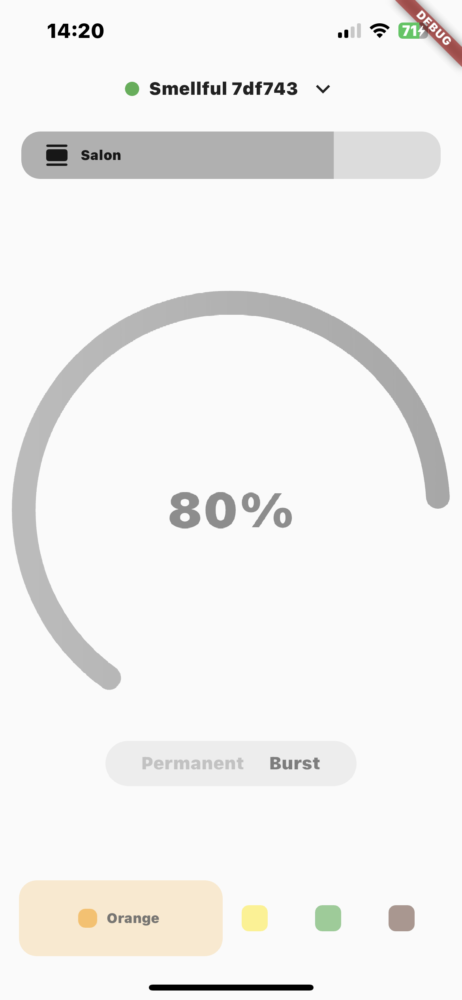
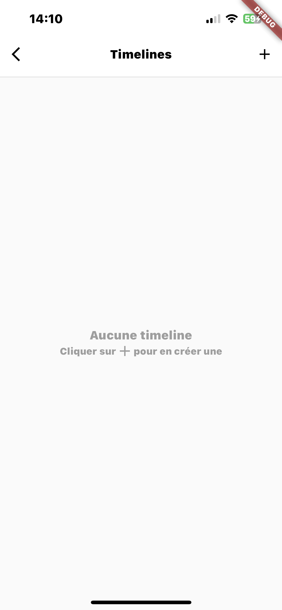
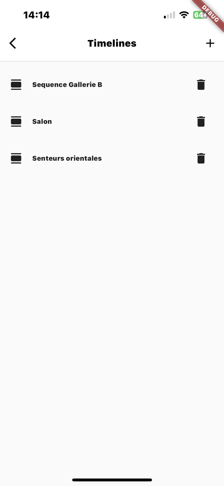
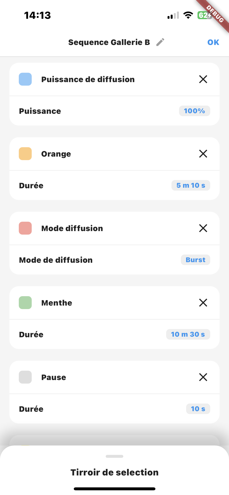
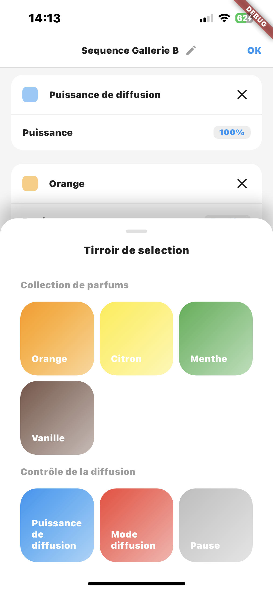
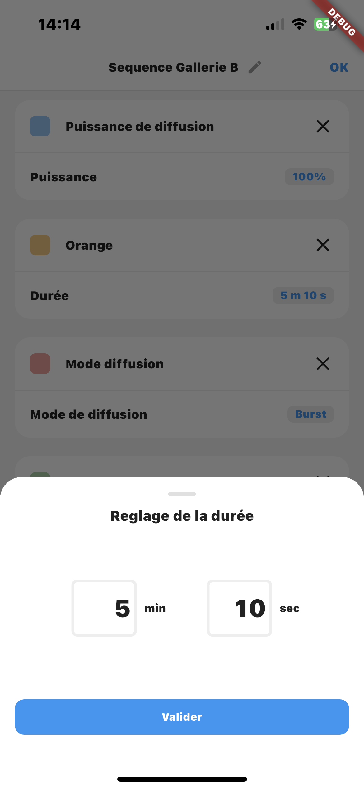
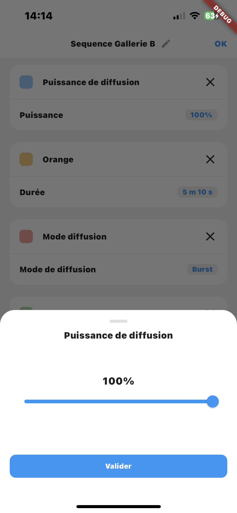
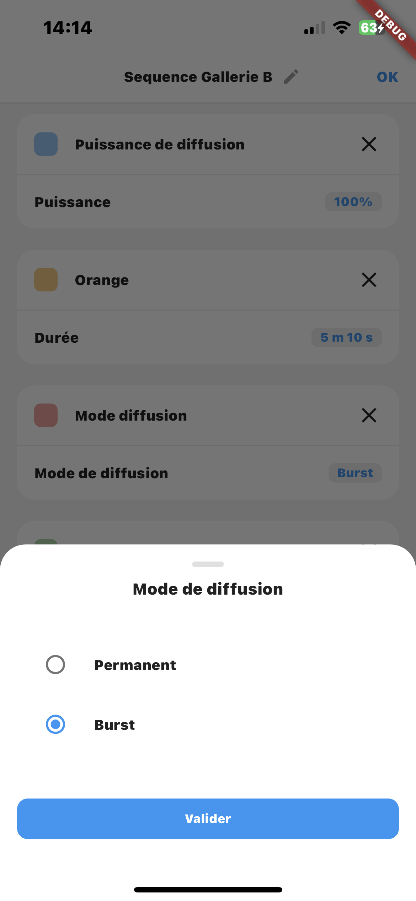

